<div dir="rtl">

# دوائي

<p align="center">
  <a href="https://dawai-gaza.vercel.app/"><strong>عرض المشروع</strong></a>
</p>

<p align="center">
  
  
  
  
  
</p>

---

## وصف المشروع

**دوائي** منصة ويب شاملة تهدف إلى معالجة أزمة الوصول إلى الدواء في **قطاع غزة**. تعمل كجسر يربط بين المواطنين والصيادلة ونقابة الصيادلة، من خلال إتاحة البحث عن الأدوية، وتحديد الصيدليات القريبة، ومتابعة توفر الأدوية وأسعارها، والاطلاع على النشرات الرسمية.

تدعم المنصة ثلاثة أدوار رئيسية:

- **النقابة:** تُشرف على المنظومة بأكملها — إدارة الأدوية، ومراقبة الصيدليات، والموافقة على طلبات التسجيل، وإصدار النشرات الرسمية، وتتبع مخالفات الأسعار.
- **الصيدلاني:** يُدير مخزون صيدليته، وينشر إعلانات ترويجية، ويُحدّث بيانات الأدوية المتاحة.
- **المواطن:** يبحث عن الأدوية والصيدليات، ويطّلع على الأسعار والنشرات الرسمية، ويصل إلى ملفات الصيدليات وخرائط مواقعها.

---

## المميزات

### مميزات النقابة
- **لوحة التحكم:** نظرة عامة على إحصائيات المنظومة (أدوية، صيدليات، مستخدمون، مخالفات).
- **إدارة الأدوية:** عمليات CRUD كاملة على قاعدة بيانات الأدوية.
- **إدارة الصيدليات:** عرض وإدارة جميع الصيدليات المسجلة.
- **نظام الموافقات:** مراجعة طلبات تسجيل الصيدليات والبت فيها.
- **مراقبة الأسعار:** رصد مخالفات الأسعار عبر الصيدليات وتوثيقها.
- **النشرات الرسمية:** نشر إعلانات وبلاغات موجهة لجميع المستخدمين.

### مميزات الصيدلاني
- **لوحة التحكم:** نظرة سريعة على حالة المخزون والإعلانات.
- **إدارة المخزون:** إضافة وتعديل وحذف الأدوية مع بيانات الأسعار والتوفر.
- **مدير الإعلانات:** إنشاء وإدارة الإعلانات الترويجية للصيدلية.

### مميزات المواطن
- **الصفحة الرئيسية:** واجهة الهبوط مع إمكانية البحث الفوري.
- **البحث عن دواء:** البحث بالاسم واستعراض الصيدليات المتوفر فيها.
- **تفاصيل الدواء:** عرض معلومات الدواء الكاملة مع الأسعار وأماكن التوفر.
- **البحث عن صيدلية:** تصفح الصيدليات والبحث بالاسم أو الموقع.
- **ملف الصيدلية:** عرض تفاصيل الصيدلية وموقعها على خريطة تفاعلية.
- **النشرات الرسمية:** قراءة الإعلانات الصادرة عن نقابة الصيادلة.

---

## معمارية النظام

يتبع النظام نمط **Client-Server Architecture** مع فصل واضح بين المسؤوليات:

| الطبقة | التقنية | الوصف |
|--------|---------|-------|
| **الواجهة الأمامية** | React.js + Tailwind CSS + MUI | عرض واجهة المستخدم والتفاعل مع API |
| **الخادم الخلفي** | Laravel 13 + PHP 8.3 | منطق الأعمال والمصادقة ونقاط الـ API |
| **قاعدة البيانات** | MySQL (TiDB Serverless) | تخزين البيانات: المستخدمون، الأدوية، الصيدليات، المخزون |
| **الخرائط** | Leaflet + React Leaflet | عرض مواقع الصيدليات على خرائط تفاعلية |
| **الرسوم المتحركة** | Framer Motion + GSAP | انتقالات وتأثيرات بصرية سلسة |

*يتم التواصل بين الواجهة والخادم عبر **RESTful APIs** مؤمّنة بـ **Laravel Sanctum**.*

---

<div dir="ltr">

## Project Structure

```
dawai/
├── Backend/          # Laravel 13 API
│   ├── app/
│   │   ├── Http/
│   │   │   └── Controllers/Api/
│   │   │       ├── AuthController.php
│   │   │       ├── MedicineController.php
│   │   │       ├── PharmacyController.php
│   │   │       ├── InventoryController.php
│   │   │       ├── PromotionController.php
│   │   │       ├── ViolationController.php
│   │   │       ├── GovernorateController.php
│   │   │       └── UserController.php
│   │   └── Models/
│   │       ├── Medicine.php
│   │       ├── Pharmacy.php
│   │       ├── Inventory.php
│   │       ├── Promotion.php
│   │       ├── Violation.php
│   │       ├── Governorate.php
│   │       └── User.php
│   └── ...
└── Frontend/         # React.js App
    └── src/
        └── pages/
            ├── citizen/        # Citizen pages
            ├── pharmacist/     # Pharmacist pages
            └── syndicate/      # Syndicate pages
```

</div>

---


## لقطات الشاشة

### الصفحة الرئيسية

| الصفحة الرئيسية | لماذا تختار دوائي؟ | كيف يعمل دوائي؟ |
| :---: | :---: | :---: |
| 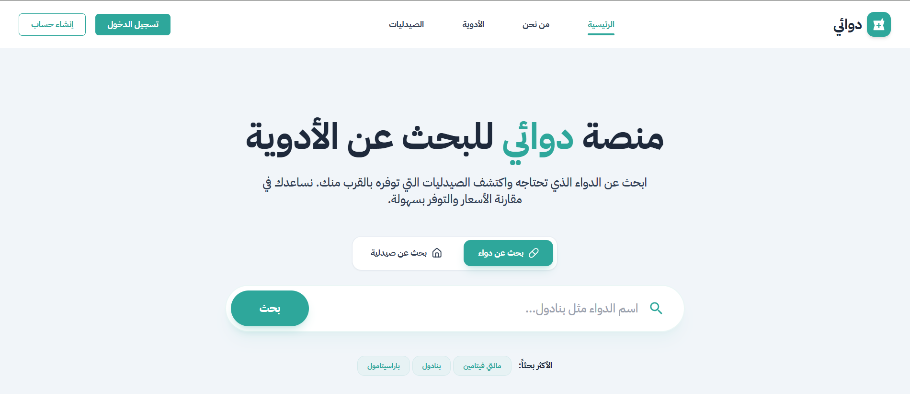 | 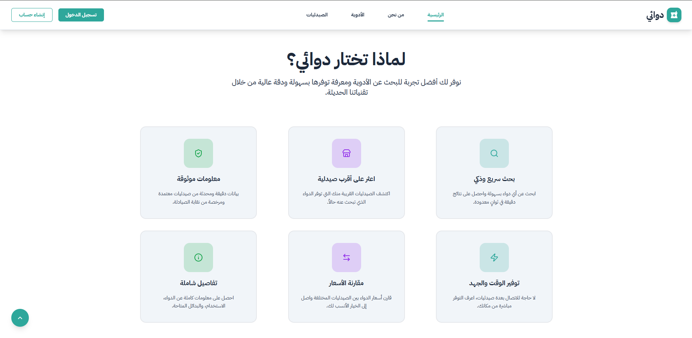 | 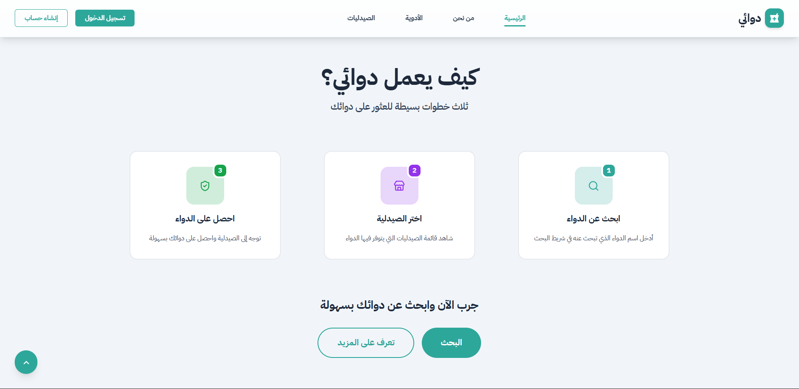 |

### المصادقة

| تسجيل الدخول | تسجيل صيدلية جديدة |
| :---: | :---: |
| 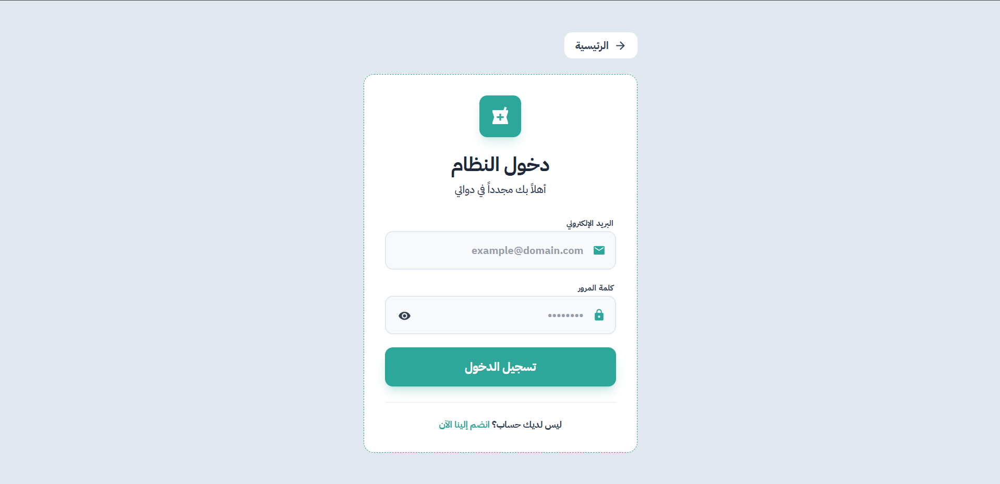 | 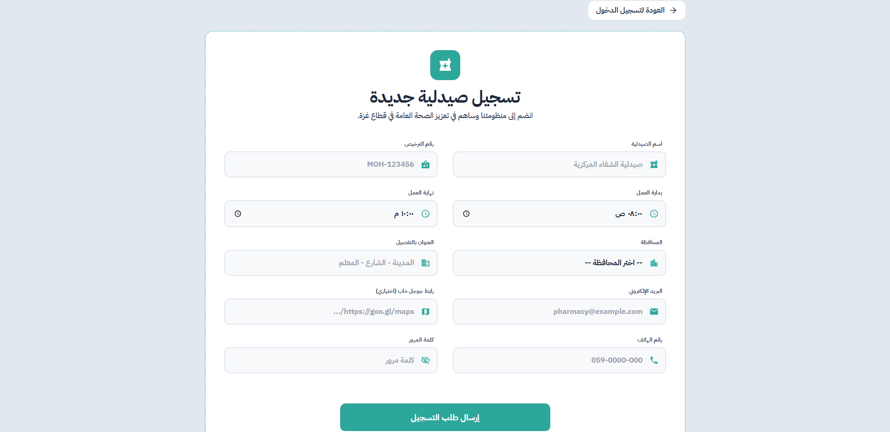 |

### تجربة المواطن

| البحث عن دواء | تفاصيل الدواء |
| :---: | :---: |
| 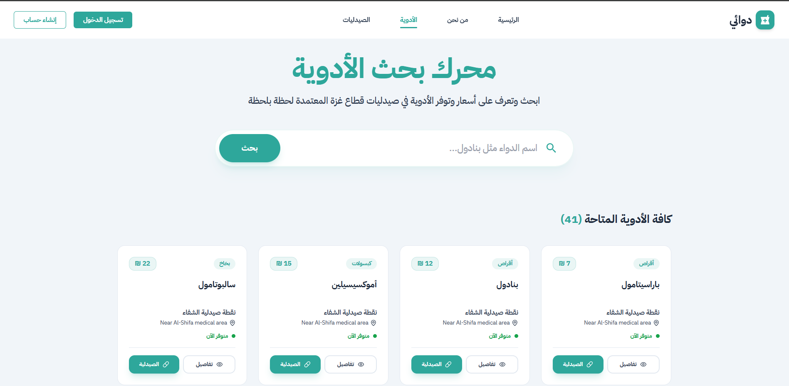 | 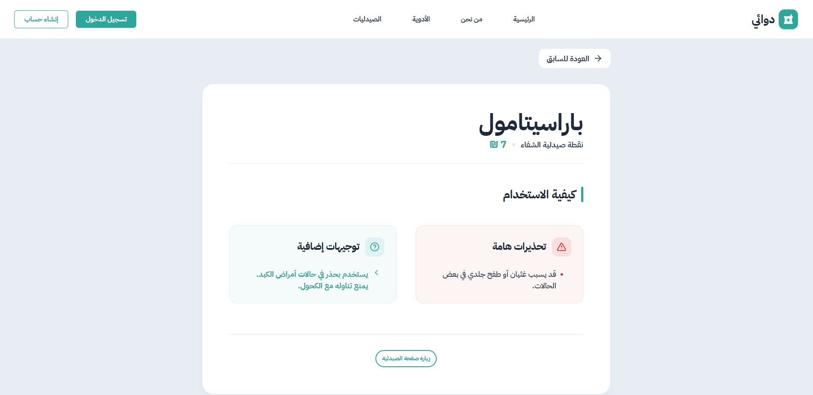 |

| البحث عن صيدلية | ملف الصيدلية |
| :---: | :---: |
| 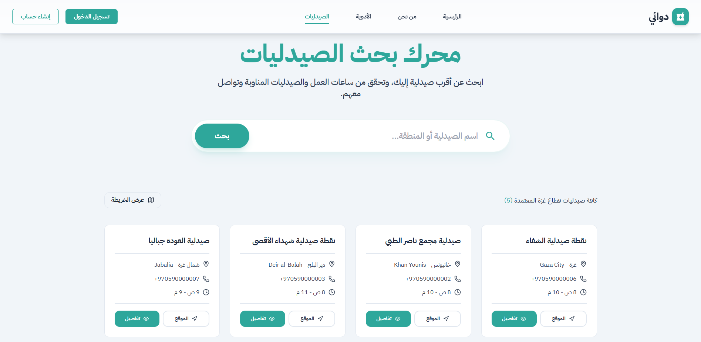 | 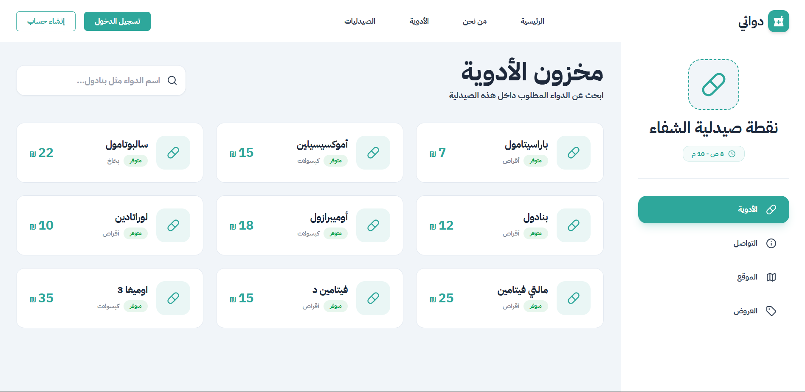 |

### لوحة تحكم الصيدلية

| لوحة تحكم الصيدلية | إدارة المخزون |
| :---: | :---: |
| 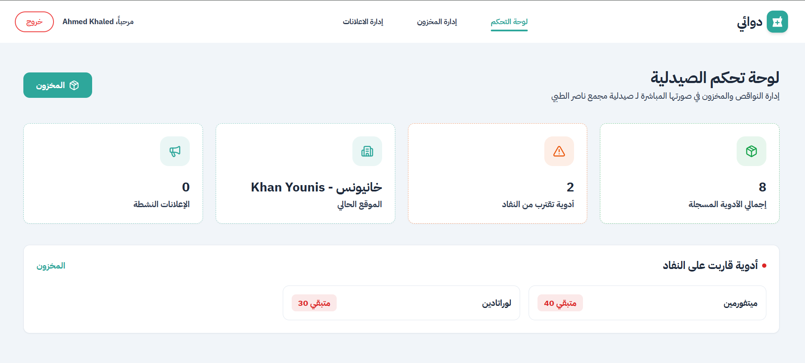 | 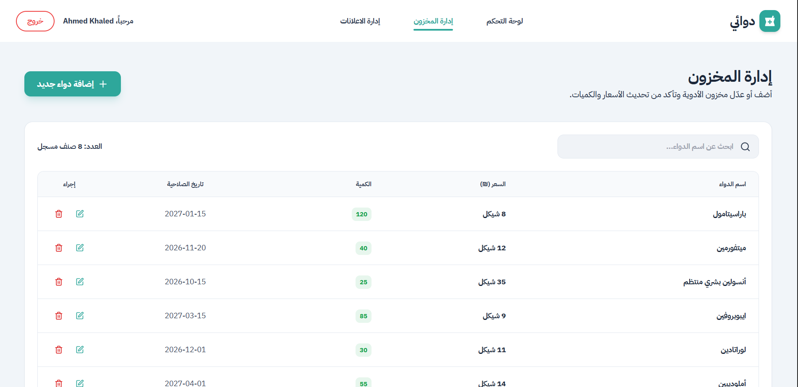 |

### لوحة تحكم النقابة

| لوحة تحكم النقابة | مراقبة الأسعار |
| :---: | :---: | 
| 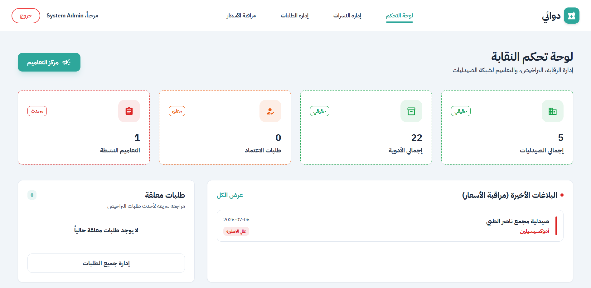 | 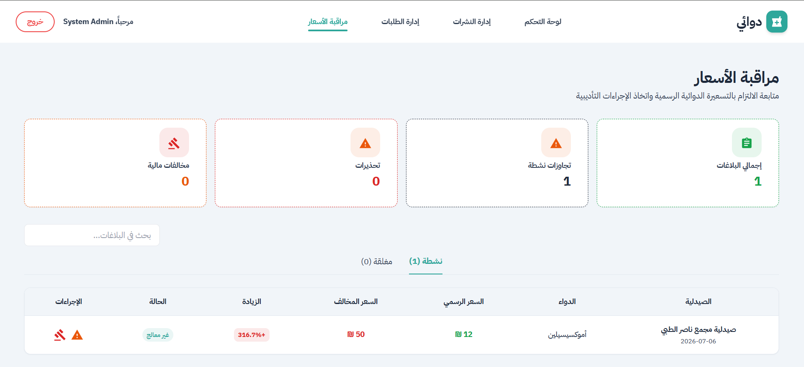 |

| طلبات اعتماد الصيدليات | النشرات الرسمية |
| :---: | :---: |
| 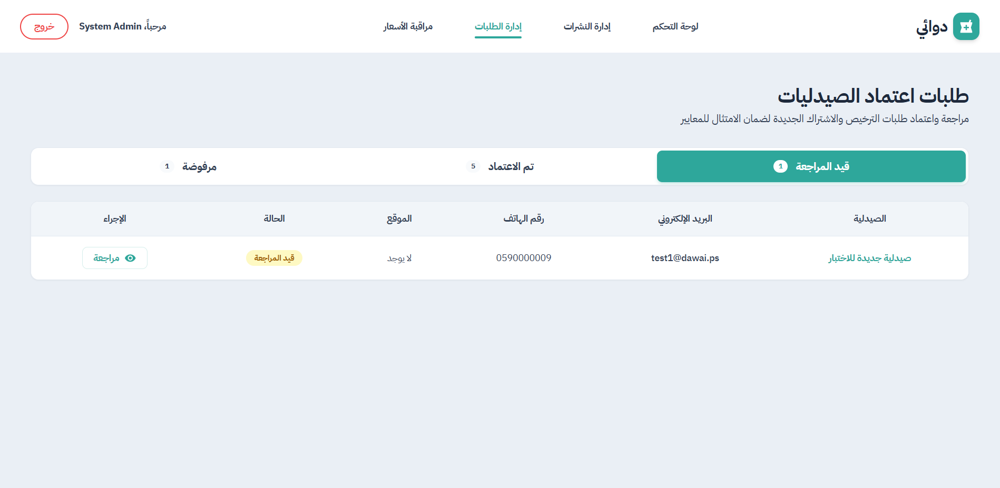 | 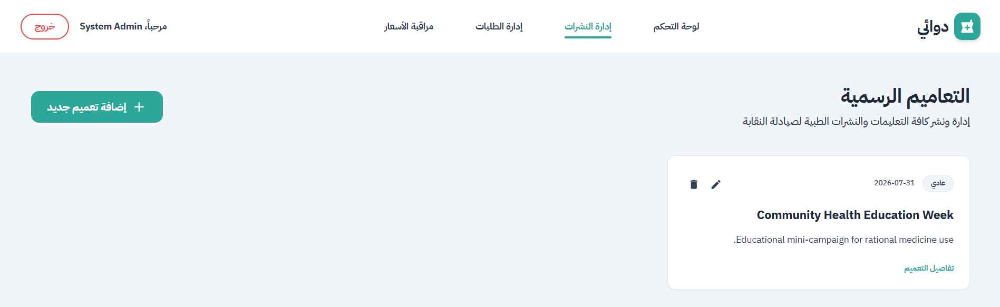 |

---

## Installation & Setup

### 1. Clone the Repository
```bash
git clone https://github.com/AbdullahAbuZaid04/dawai-gaza.git
cd dawai-gaza
```

### 2. Setup Backend (Laravel)

1. Navigate to the backend folder:
   ```bash
   cd Backend
   ```
2. Install PHP dependencies:
   ```bash
   composer install
   ```
3. Copy the environment file and configure your variables:
   ```bash
   cp .env.example .env
   ```
   Then edit `.env` with your values:
   ```env
   APP_NAME=Dawai
   APP_URL=http://localhost:8000

   DB_CONNECTION=mysql
   DB_HOST=your_db_host
   DB_PORT=3306
   DB_DATABASE=your_db_name
   DB_USERNAME=your_db_user
   DB_PASSWORD=your_db_password

   ALLOWED_ORIGINS=http://localhost:3000
   SANCTUM_STATEFUL_DOMAINS=localhost:3000
   ```
4. Generate the application key:
   ```bash
   php artisan key:generate
   ```
5. Run database migrations:
   ```bash
   php artisan migrate
   ```
6. *(Optional)* Seed the database with sample data:
   ```bash
   php artisan db:seed
   ```
7. Start the development server:
   ```bash
   php artisan serve
   ```

### 3. Setup Frontend (React)

1. Navigate to the frontend folder:
   ```bash
   cd ../Frontend
   ```
2. Install dependencies:
   ```bash
   npm install
   ```
3. Create a `.env.local` file and set the API URL:
   ```env
   REACT_APP_API_URL=http://localhost:8000/api
   ```
4. Start the development server:
   ```bash
   npm start
   ```

The app will be available at `http://localhost:3000`

---

## توثيق الـ API

التوثيق الكامل لنقاط الـ API متوفر في:
- [`API_JSON_Part1.md`](./API_JSON_Part1.md) — المصادقة، الأدوية، الصيدليات
- [`API_JSON_Part2.md`](./API_JSON_Part2.md) — المخزون، العروض الترويجية، المخالفات، النشرات

---

## التقنيات المستخدمة

| الفئة | التقنية |
|-------|---------|
| إطار الواجهة الأمامية | React.js 19 |
| مكتبة واجهة المستخدم | Material UI (MUI) v7 |
| التنسيق | Tailwind CSS v3 |
| الرسوم المتحركة | Framer Motion, GSAP |
| الخرائط | Leaflet, React-Leaflet |
| طلبات HTTP | Axios |
| إطار الخادم الخلفي | Laravel 13 |
| لغة البرمجة | PHP 8.3 |
| المصادقة | Laravel Sanctum |
| قاعدة البيانات | MySQL (TiDB Serverless) |
| نشر الواجهة | Vercel |
| نشر الخادم | Railway |

---

## المشرف الأكاديمي

تم تطوير هذا المشروع تحت الإشراف والتوجيه من قِبل: **أ.د. حاتم حماد**

---

## فريق العمل

الفريق الذي أنجز هذا المشروع:

| **عبدالله أبوزيد** | **يوسف اللحام** | **هاني الخطيب** | **عبدالله الهنداوي** |
| :---: | :---: | :---: | :---: |
| مطور واجهة أمامية | مطور خادم خلفي | مطور خادم خلفي | مطور قواعد بيانات |

---

<p align="center">
  <sub>طُوِّر بواسطة فريق دوائي — © 2026 جميع الحقوق محفوظة</sub>
</p>

<p align="center">
  <a href="#دوائي">
    
  </a>
</p>

</div>
